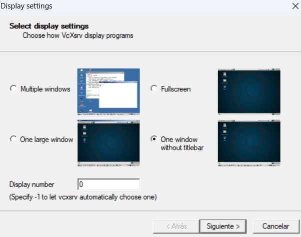

# Implementacion del contenedor de Docker

## ¿Por que usamos Docker?

Durante la realizacion del trabajo, nos encontramos con diversas dificultades a la hora de hacer coincidir las versiones de ROS, Gazebo y las distintas distribuciones de Linux con sus respectivos paquetes.

Por tanto, acudimos a la dockerizacion del entorno de desarrollo, lo que nos permite construir un entorno "desechable" o "temporal" sobre el cual se instalan unica y exclusivamente las versiones del software que necesitamos para el desarrollo.

En primer lugar, se tomo la decision de trabajar en la version de Ubuntu 22.04 LTS, la cual esta soportada por la version de ROS2 "Humble LTS", siendo esta ultima la version mas moderna de ROS con soporte a largo plazo. Dicha decision se tomo con el fin de sacarle una mayor partida a las nuevas funcionalidades de ROS2 y evitar incompatibilidades con versiones mas recientes de Ubunto.

Para llevar a cabo el proceso de dockerizacion sobre dichas versiones, se construye un archivo en la carpeta raiz del proyecto, llamado "Dockerfile", el cual posee una descripcion, a modo de capas, de todo el software que se requiere dentro del entorno donde se va a trabajar. Por otro lado, en dicho archivo deben definirse todas aquellas instrucciones pertinentes para permitir la utilizacion de la GPU por parte de docker (ya que gran parte del software ejecuta codigo orientado a la aceleracion por hardware para 3d).

En este punto, ya estamos listos para realizar un "build" de nuestro contenedor, esto se lleva a cabo mediante el comando:

```bash
docker build -t r2_boxbots .
```

Ya habiendo realizado la compilacion de la imagen de docker, nos encontramos en condiciones de ejecutar el entorno. Dado que Docker no expone de forma predeterminada una interfaz grafica, se debe realizar una conexion entre el servidor de ventanas del sistema operativo anfitrion y el container. Esto se hace mediante la creacion de un volumen que replique los archivos de X11 (servidor de ventanas de Linux) del sistema operativo anfitrion y dejarlos disponibles para que el container de Docker se comunique con el usuario haciendo uso del mismo. Asi, al ejecutar nuestro contenedor, todas aquellas aplicaciones con interfaces graficas se mostraran en nuestra pantalla como si se ejecutaran de forma nativa.

Para correr el entorno dockerizado se puede utilizar el archivo run_docker_gpu.bash.

```bash
./run_docker.sh
```
Es necesario tener instalado Docker y xhost para poder correr la visualización de Gazebo. 

Una vez ejecutado el comando anterior, para entrar en el container creado se debe ejecutar el siguiente comando en la terminal:

```bash
docker exec -it r2_boxbots_container bash
```

Entendiendo la logica del primer comando vemos:

```bash
docker run -it \ # Ejecuta el contenedor en modo interactivo
  --name=r2_boxbots_container \ # nombre del contenedor
  --env="DISPLAY=$DISPLAY" \ # le indica que el display de salida es el display de la maquina host
  --env="QT_X11_NO_MITSHM=1" \ # le indica que no se use el MIT-SHM extension
  --volume="/tmp/.X11-unix:/tmp/.X11-unix:rw" \ # monta el directorio de salida de la maquina host en el contenedor (para grafica)
  --volume="${PWD}:/root/project" \ # monta el directorio actual en el contenedor
  --env="XAUTHORITY=$XAUTH" \ # le indica que el archivo de autorización es el de la maquina host
  --volume="$XAUTH:$XAUTH" \ # monta el archivo de autorización en el contenedor
  --net=host \ # le indica que use la red de la maquina host
  --privileged \ # le da privilegios al contenedor
  r2_boxbots \ # nombre de la imagen
  bash # comando a ejecutar
```

# Dockerizacion

## En windows

### Pasos previos
En windows es necesario instalar la herramienta [VcXsrv](https://sourceforge.net/projects/vcxsrv/) para poder visualizar Gazebo.
Luego de instalarlo hay que configurarlo, para ello, una vez instalado, se debe abrir el programa y configurar las opciones como se muestra en la siguiente imagen:



donde el Display number 0 es el que vamos a utilizar luego para darle salida de video al contenedor.

### Construccion

Para construir la imagen de docker se puede utilizar el comando:
```bash
docker build -t r2_boxbots .
```

### Ejecucion
Para correr el entorno dockerizado se puede utilizar el archivo run_docker_gpu.bat
  
  ```bash
  run_docker.bat
  ```

Una vez ejecutado el comando anterior, para entrar en el container creado se debe ejecutar el siguiente comando en la terminal:
  
  ```bash
  docker exec -it r2_boxbots_container bash
  ```
Podemos explicar la logica del primer comando de la siguiente manera:

```bash 
docker run -it \
  --name=r2_boxbots_container \ # nombre del contenedor
  -e DISPLAY=host.docker.internal:0.0 \  # le indica que el display de salida es el display de la maquina host
  -e LIBGL_ALWAYS_INDIRECT=0 \ # le indica que no use el MIT-SHM extension
  --volume="${PWD}/../:/root/project" \ # monta el directorio actual en el contenedor
  r2_boxbots \ # nombre de la imagen
  bash # comando a ejecutar
```
