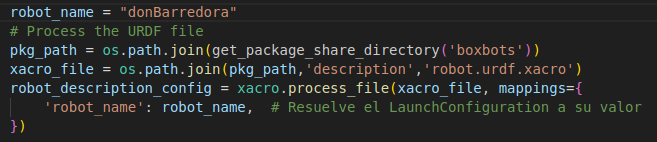
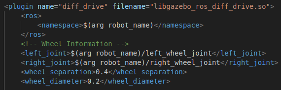
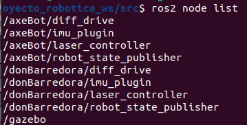
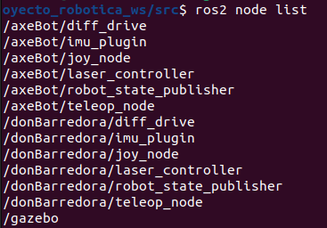
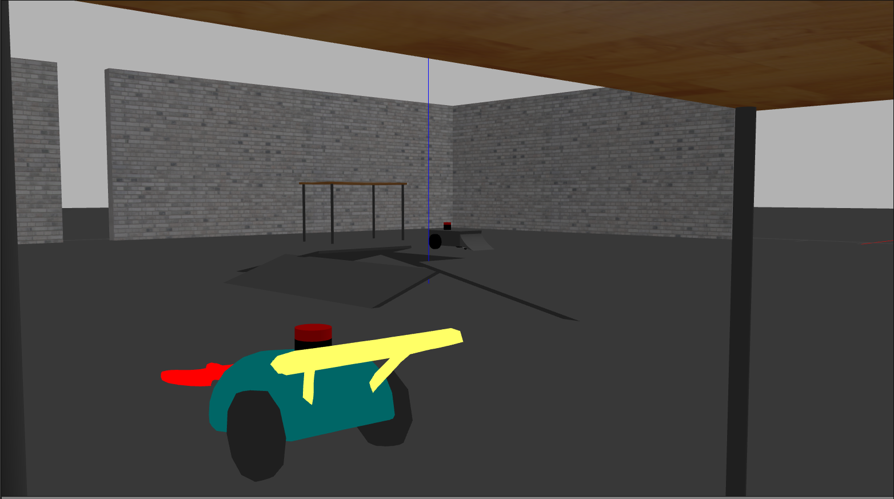

# Implementación de multiples robots

  Dado que los robots construidos están diseñados a partir de una misma base, con un número idéntico de actuadores y sensores, los nodos y tópicos utilizados por cada
robot comparten los mismos nombres. Esto puede generar problemas al comunicarse con los nodos, ya que estarían utilizando los mismos canales para transferir datos, 
lo que puede resultar en que la información sea leída por el robot equivocado.

  Para solucionar esto, se utilizan los namespaces para agrupar los nodos en xontextos individuales, permitiendo que 2 nodos con el mismo nombre esten completamente 
separados, esto se hace declarando como paramatetro el nombre del namespace al crear los nodos y pasandoselo como paramerto a los plugins de los robots:

  

    
    
  

 Al simular varios robots en un mismo entorno, puedes ejecutar el comando `ros2 node list` en una nueva terminal para mostrar la lista de nodos activos junto con sus
 namespaces correspondientes.

  

    
  

Se pueden ejecutar los comandos de los joystick para levantar los nodos de teleoperacion de cada robot

  

    
  

Al correr el comando indicado en el README se ejecutara la simulacion con los 2 robots empezando en su posición inicial correpondiente

 

    
  

