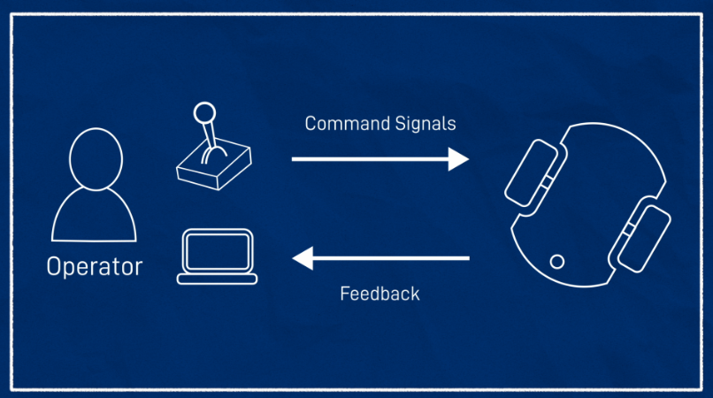
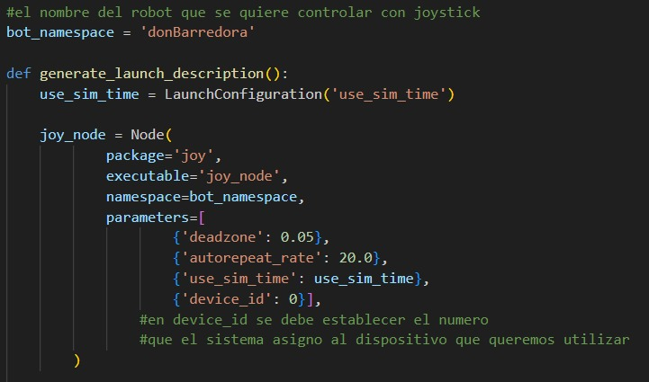
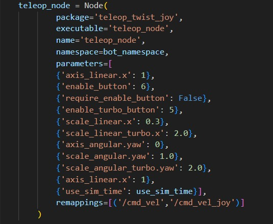

# Teleoperación

La teleoperación se refiere al control de un robot desde una ubicación remota, es decir, mediante control remoto. Esto se contrapone a la operación autónoma, donde al robot se le asigna una tarea específica que debe completar de manera independiente.

Aunque se busca que los robots sean lo más autónomos posible, en muchas situaciones todavía se requiere la intervención humana, especialmente durante las fases de desarrollo, configuración o en situaciones complejas.
La teleoperación suele constar de dos partes:

- Envío de señales de comando al robot: Esto suele implicar el envío de comandos de velocidad u otras instrucciones de movimiento.
- Recepción de datos de sensores desde el robot: Esta parte puede ser opcional si el operador está físicamente presente con el robot, pero es crucial para la operación remota, ya que proporciona retroalimentación visual y de otro tipo que ayuda a guiar el control del robot.


<p align="center" width="100%">
    
</p>


## Teleoperación utilizando teclado

Una forma de teleoperar los robots es utilizando `teleop_twist_keyboard`, el cual es una herramienta para la teleoperación básica de robots móviles. Permite controlar un robot utilizando los comandos del teclado de una computadora.

Funcionalidad: Traduce las pulsaciones del teclado en mensajes que controlan la velocidad lineal y angular del robot.

Limitaciones: 

- No proporciona una interfaz gráfica sofisticada ni control avanzado del robot.
- Requiere que la ventana de terminal se mantenga abierta y activa

Por lo tanto se busco una solucion más eficiente para teleoperar a los robots, la cual es utilizar joysticks o controles. 

## Teleoperación utilizando joystick

Los gamepads o joysticks son ideales para la robótica porque están diseñados para dirigir algo con facilidad, generalmente en un contexto virtual. Tienen varios ejes y numerosos botones, lo que permite activar diversas funciones necesarias para la operación del robot.

Con ROS, se puede decidir si conectar el gamepad directamente a la computadora del robot o a una estación base o máquina de desarrollo. Conectar a la máquina de desarrollo facilita el cambio entre simulación y el robot real sin modificar la configuración, aunque conectar directamente al robot puede ofrecer mejor rendimiento debido a la menor latencia.

### Configuración en Linux

Para verificar que el gamepad funciona en Linux, se pueden instalar herramientas útiles:

````
sudo apt install joystick jstest-gtk evtest
````

Con el controlador conectado (vía USB o Bluetooth), se puede usar evtest para comprobar que los botones y ejes del gamepad funcionan correctamente.

### Integración en ROS
ROS incluye paquetes que facilitan la integración de gamepads y joysticks. En lugar de ejecutar un programa que genere mensajes Twist directamente, el proceso se divide en dos partes:

- Comunicación con el joystick: A través de los controladores de Linux, se publica un mensaje sensor_msgs/Joy que contiene el estado de los botones y ejes del gamepad.
- Uso de los datos del joystick: Otros nodos pueden utilizar estos datos para desencadenar comportamientos específicos, como mover una cámara o controlar el movimiento del robot.

Para verificar qué controladores puede ver ROS, se puede usar:

````
ros2 run joy joy_enumerate_devices
````

Usualmente, se usa el controlador con el ID 0. 

Para ejecutar el nodo joy en ROS:

````
ros2 run joy joy_node
````

### Creación de archivos de lanzamiento y parámetros con Python

Para configurar el control del gamepad, es necesario crear un archivo de lanzamiento y un archivo de parámetros. Esto es importante porque el siguiente nodo que vamos a ejecutar tiene muchos parámetros que especificar.

#### Archivo de parametros

Debemos crear un archivo llamado joystick.yaml en el directorio config. Por ejemplo, puede contener los siguientes parámtros y valores:

````
joy_node:
  ros__parameters:
    device_id: 0
    deadzone: 0.05
    autorepeat_rate: 20.0
````

Nosotros especificamos los parametros dentro de la generacion del nodo `joy_node`:

<p align="center" width="100%">
    
</p>

##### Conversión de Joy a Twist
Una vez que los datos del joystick están disponibles en /joy, es necesario convertirlos a un mensaje Twist usando el paquete teleop_twist_joy. Esto permite controlar el robot basándose en la entrada del joystick.

Se puede configurar un archivo de parámetros joystick.yaml para especificar las características del gamepad, como los ejes utilizados para el movimiento lineal y angular, las velocidades máxima y turbo, y los botones de habilitación.

Ejemplo de parámetros:

````
teleop_node:
  ros__parameters:
    axis_linear:
      x: 1
    scale_linear:
      x: 0.5
    scale_linear_turbo:
      x: 1.0
    axis_angular:
      yaw: 0
    scale_angular:
      yaw: 0.5
    scale_angular_turbo:
      yaw: 1.0
    require_enable_button: true
    enable_button: 6
    enable_turbo_button: 7
````

Paticularmente, en la figura siguiente se aprecia los parámetros especificados del yaml utilizando Python.

<p align="center" width="100%">
    
</p>

Estos parametros se establecieron en base a un joystick de ps4. Ante la imposibilidad de movimiento se debe comprobar los controles asignados (especificamente `axis_linear.x` y `axis_angular.yaw` que establecen qué botones del control se utilizan para el movimiento `lineal` y `angular` respectivamente). Recordando lo siguiente: la velocidad lineal es la velocidad a la que desea que el robot se mueva hacia adelante o hacia atrás, mientras que la velocidad angular define qué tan rápido desea que el robot gire en el sentido de las agujas del reloj y en el sentido contrario a las agujas del reloj.

Para el movimiento del robot se utiliza el botón `L3` del control (hacia arriba y abajo se controla el movimiento lineal, y hacia la derecha e izquierda se controla el movimiento angular). 

Y el parametro `enable_turbo_button`, fijado en el botón `R1`, establece qué botón se utiliza para asignarle mayor velocidad (no incremental). 

#### Archivos de lanzamiento (launch)

- El archivo joystick0.launch.py en el directorio de lanzamiento, lanza los nodos `joy_node` y `teleop_node` con sus respectivos parametros especificados anteriormente, controlando el robot `donBarredora` y utilizando el joystick que se le haya asignado `device_id`: 0. 

- El archivo joystick1.launch.py realiza el lanzamiento de los mismos nodos pero controlando al robot `axeBot` y utilizando el joystick que se le haya asignado `device_id`: 1. 


## Obtener Retroalimentación

La retroalimentación es crucial en la teleoperación, ya que permite al operador recibir información sobre el estado y entorno del robot. RViz es una herramienta potente en ROS para visualizar esta información, aunque no siempre es la mejor opción para todas las aplicaciones. 
Los tipos de retroalimentacion contribuyen en el efecto de obtener una mayor precision del estado físico real del robot. Entre sus tipos están:

- Odometría: Proporciona una idea general de la posición y el movimiento del robot basado en los encoders de los motores.
- Feed de Cámara: Permite al operador ver lo que el robot "ve", proporcionando una retroalimentación visual directa.
- Feed de Lidar: Proporciona información sobre el entorno del robot, especialmente útil en espacios interiores y corredores.
