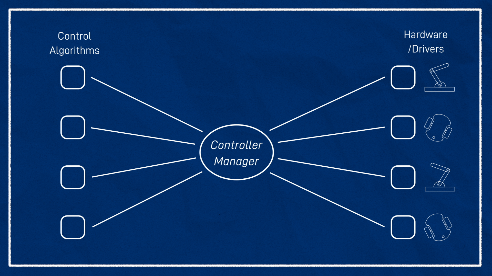
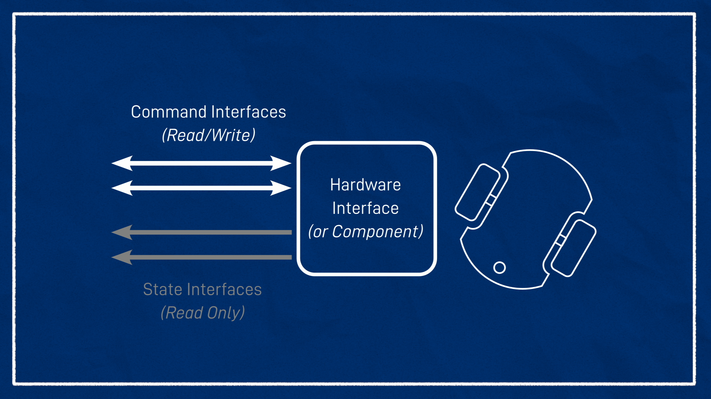
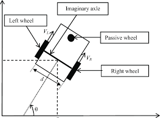
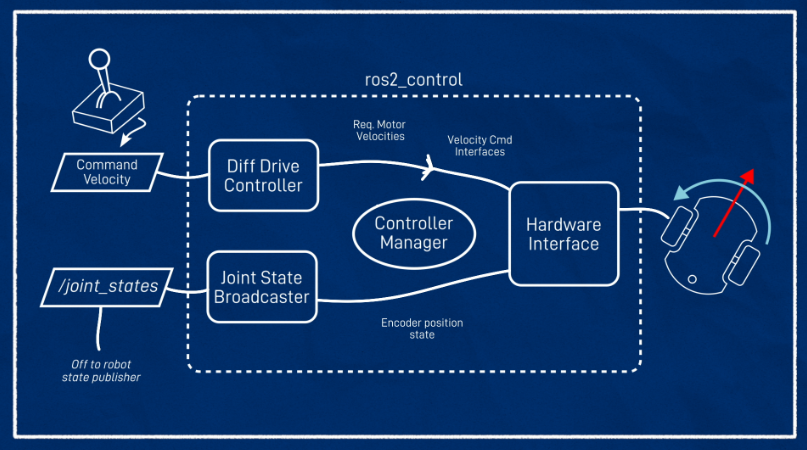
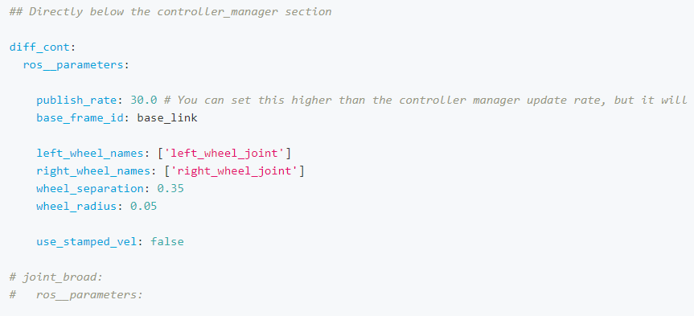

# Control 

Para el control del robot simulado se utilizara ros2_control,el cuál es un framework para el control (en tiempo real) de robots utilizando (ROS 2). Sus paquetes son una reescritura de los paquetes ros_control utilizados en ROS (Robot Operating System). El objetivo de ros2_control es simplificar la integración de nuevo hardware y superar algunos inconvenientes.

## ros2_control

En esta sección se presenta cómo funciona ros2_control y cómo se utilizará en la simulación. 

### Controller Manager
Como principal componente se encuentra Controller Manager. El cuál encontrará todos los bits de código para nuestros drivers de hardware y controladores y los vinculará. Es una biblioteca que se carga en tiempo de ejecución y tiene un conjunto de funciones que se vincularán al sistema.

<p align="center" width="100%">
     
</p>
Hardware diferente se debe controlar diferente. Cualquiera que sea el aspecto del hardware, para usar ros2_control con él, necesitamos algo llamado hardware interface  (a veces llamado hardware component). Este es un fragmento de código que se comunica con el hardware y lo expone de la forma estándar ros2_control. 

<p align="center" width="100%">
     
</p>

*Hardware interface* actúa como una abstracción, de modo que, como usuarios, todo lo que necesitamos entender es la forma en que representa nuestro hardware, que es a través de interfaces de comando e interfaces de estado. Las interfaces de comando son cosas que podemos controlar y las interfaces de estado son cosas que solo podemos monitorear.

El trabajo del *controller manager* es tomar los controladores que se le solicita cargar y relacionarlos con las interfaces de comando y estado correctas que el administrador de recursos está exponiendo. Para configurar los controladores, escribimos un archivo YAML con los diversos parámetros que necesitamos y lo pasamos al controller manager. 

El proyecto en el que estamos trabajando es un robot de accionamiento diferencial (differential drive), por lo que, naturalmente, usaremos diff_drive_controller. 


<p align="center" width="100%">
     
</p>

La tracción diferencial (differential drive) es un sistema de tracción de dos ruedas con actuadores independientes para cada rueda. El nombre se refiere al hecho de que el vector de movimiento del robot es la suma de los movimientos independientes de las ruedas. Las ruedas motrices generalmente se colocan a cada lado del robot. 

#### Ejecución de controller manager

Para ejecutar el controller manager se utilizará `ros2_control_node` provided by the `controller_manager` package. Al cual se le debe proporcionar los detalles de las interfaces de hardware (generalmente a través de URDF) y los controladores (generalmente a través de parámetros YAML).

#### Construcción de ros2_control.xacro

<p align="center" width="100%">
     
</p>

Dentro del tag `ros2_control` agregamos una etiqueta <hardware> con una etiqueta <plugin> dentro, y este será el nombre de la interfaz de hardware que necesita cargar. En este caso, el nombre del complemento que queremos usar es `gazebo_ros2_control/GazeboSystem`, así que podemos ponerlo allí.

Ahora necesitamos especificar qué joints (articulación) se van a controlar, por lo que creamos etiquetas para los joints y establecemos el nombre; en este caso, las joints que van desde la base hasta las ruedas izquierda y derecha. También debemos declarar qué interfaces están disponibles para esa articulación. Vamos a tener una interfaz de comando para cada rueda (velocidad) con la opción de especificar límites, y dos interfaces de estado (velocidad/posición).

Ahora necesitamos configurar la etiqueta `<gazebo>`. Comienza de manera similar a `gazebo_control.xacro`, dentro de nuestra etiqueta `<gazebo>` tenemos una etiqueta `<plugin>`. Esta vez el nombre del archivo del complemento es `libgazebo_ros2_control.so` y podemos darle un nombre, `gazebo_ros2_control`. Este complemento en realidad hace algunas cosas diferentes:

Esa es la etiqueta ros2_control lista, le hemos indicado la interfaz de hardware que debe cargar y con qué uniones asociarse. Ahora necesitamos configurar la etiqueta <gazebo>.

Comienza de manera similar a gazebo_control.xacro, dentro de nuestra etiqueta <gazebo> tenemos una etiqueta <plugin>. Esta vez el nombre del archivo del complemento es libgazebo_ros2_control.so y podemos darle un nombre, gazebo_ros2_control. Este complemento realiza lo siguiente:

- Carga lo necesario en el extremo del Gazebo para hablar con la interfaz de hardware
- Ejecuta un administrador de controlador
- Encontrar la URDF proporcionada por robot_state_publisher


Debido a que tiene el administrador de controladores dentro, todavía necesita un archivo de parámetros YAML para saber qué controladores cargar. Para contarlo, necesitamos agregar una etiqueta llamada `<parameters>` y esta será la ruta a nuestro archivo YAML. Por lo tanto, lo suiguiente es generar ese archivo YAML con las configuraciones necesarias. 

<p align="center" width="100%">
     
</p>

Dos parámetros simples de configurar son update_rate, que determina la velocidad a la que se actualizarán los controladores, y use_sim_time porque queremos usarlo con una simulación de Gazebo.

<p align="center" width="100%">
     
</p>
Necesitamos crear dos controladores, un diff_drive_controller y un joint_state_broadcaster. 

`diff_drive_controller`, proporcionado por ros2_controllers, que convierte nuestra velocidad de comando en velocidades de rueda. El control se realiza en forma de un comando de velocidad, que se divide y luego se envía a las dos ruedas de una base de tracción diferencial. La odometría se calcula a partir de la información del hardware y se publica

`Joint_state_broadcaster` simplemente usa las posiciones del codificador de rueda para publicar el mensaje /joint_states que robot_state_publisher necesita para generar las transformaciones de rueda.


### Configuraciones de lanzamiento

Para utilizar `ros2_control.xacro` (el cuál cuenta con las configuraciones necesarias para controlar el movimiento del robot con un joystick) se debe configurar el archivo: `rsp.launch.py`. En el mismo se debe establecer en la variable `robot_description_config` el siguiente mapping: `'use_ros2_control'`: `'true'`.
En caso de establecerlo como `'false'` se utiliza  `gazebo_control.xacro`.


El siguiente comando realiza el launch de una simulación con todos los nodos necesarios para el control del robot.

``` 
ros2 launch boxbots launch_sim_joy.launch.py
```

El siguiente launch ejecuta el teleoperation del joystick:  
``` 
ros2 launch boxbots joystick.launch.py
```


