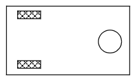
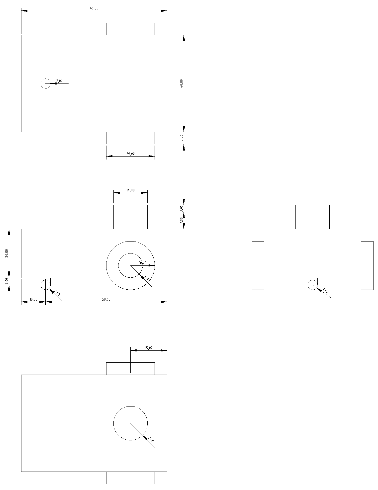
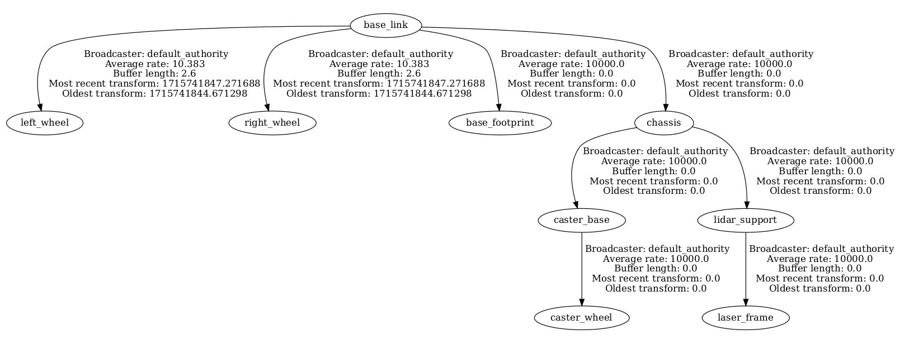
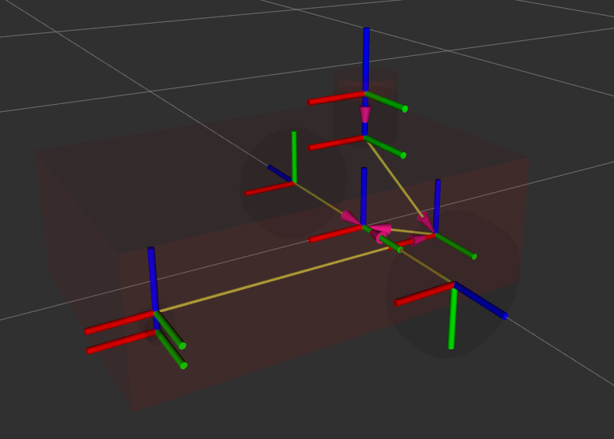
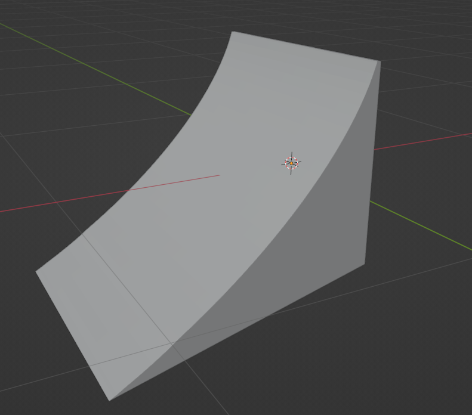

# Diseño y modelado

Para describir las características físicas del robot en ROS se utiliza la *robot description*, información contenida en un archivo URDF (Unified Robot Description Format). URDF describe al robot como un árbol de *links*, conectados por *joints*. Los *links* representan los componentes físicos del robot, como pueden ser ruedas, chasis, sensores, etc. Los *joints* representan la unión entre dos *links* y como se moverán relativamente entre ellos.

Se propuso crear tres modelos de robot móvil con características similares, para así poder simular "peleas" y observar como afectan las colisiones entre estos en cada sistema de coordenadas propio (base_link). 

## Geometría y configuración de ruedas

Nuestros robots tienen un chasis con geometría de caja rectangular o de cápsula. Y todos tienen una configuración de 2 ruedas con manejo independiente y una rueda esférica, omnidireccional y con una fricción relativamente baja, la cual servirá de apoyo. El diseño en el que se inspiraron los robots utilizados en el proyecto, se puede observar a continuación.

### Robot Core
En principio se propuso un modelo base, a partir del cual se crearon dos modelos y plantó las dimensiones básicas del total. Las dimensiones base del chasis del robot fueron de 60cm x 40cm x 20cm (dx, dy, dz).

Se creó un dibujo con las cotas más importantes para escribir el archivo URDF de forma apropiada y precisa.
<!--- Se podría recortar la imagen y tener solo el plano lateral --->

Se pueden observar los distintos componentes del robot:

- 2 ruedas estándar,
- 1 rueda omnidireccional esférica,
- chasis con forma de caja,
- un soporte para el LiDAR,
- y el LiDAR.

#### URDF

A partir del diseño planteado, se calcularon todos los origenes y dimensiones de los *links*, junto a sus *joints*. El árbol de *links* se puede observar mediante el programa *view_frame* del paquete *tf2_tools*.

En el espacio 3D, los sistemas de coordenadas del modelo se pueden visualizar con RViz. Los vectores con flecha rosada apuntan hacia el sistema de coordenadas con el cual se referencian. 

Se añadieron las propiedades de colisión, correspondientes a la geometría, y las propiedades físicas. Cada *link* a simular requiere una tag "inertial" el cual contiene información de:

- La masa (en kg) del componente.
- La matriz de inercia rotacional. Calculada, para cada *link* con una forma geométrica primitiva, usando este [listado de de momentos de inercia](https://en.wikipedia.org/wiki/List_of_moments_of_inertia#List_of_3D_inertia_tensors).

A la esfera de apoyo se le agregaron coeficientes de contacto mu1 y mu2 cercanos a 0, para simular una rueda esférica.

### Don Barredora

Basándonos en el modelo URDF "Robot Core", se procedió a su expansión mediante la incorporación de una rampa, dando lugar a una variante del robot base denominada "Don Barredora".

La rampa se modeló utilizando [Blender](https://docs.blender.org/), y los momento de inercia fueron calculados utilizando [MeshLab](https://www.meshlab.net/), específicamente la herramienta "Compute Geometric Measures". 

