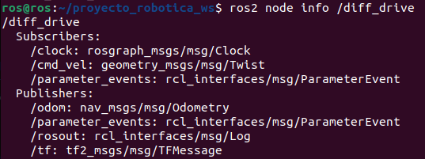

# Cinemática

## Differential Drive

La cinemática de los robots móviles creados, utilizan el modelo de conducción diferencial. Esta utiliza dos ruedas, cada una de diámetro $r$, y dado un punto $P$ centrado entre las dos ruedas, cada rueda tiene una distancia $l$ desde $P$. Dado $r$, $l$, $\theta$ y la velocidad de giro de cada rueda $\dot \varphi_l$ y $\dot \varphi_r$, el modelo de cinemática directa puede predecir la velocidad total del robot en el sistema de referencias global:

$$
\dot \xi_I = \left[\begin{array}{rrr}
  \dot x \\
  \dot y \\
  \dot \theta \\
  \end{array}\right]
  = f(l, r, \theta,\dot \varphi_l, \dot \varphi_r)
$$

Utilizando la siguiente ecuación:

$$
\dot \xi_R = R(\frac {\pi}{2}) \dot \xi_I 
$$

siendo 

$$
R(\theta) =\left[\begin{array}{rrr}
  cos \theta &  sin \theta & 0\\
  -sin \theta & cos \theta & 0\\
  0 & 0 & 1 \\
  \end{array}\right]
$$

podemos computar el movimiento del robot en el marco de la referencia global a partir del movimiento en sus sistema de referencia local: $ \dot \xi_R = R(\theta)^{-1} \dot \xi_R $.

### Plugin Differential Drive

Gazebo ofrece un plugin de modelo que provee un controlador básico para robots de conducción diferencial. Para que funcionara correctamente en nuestros robots, fué necesario pasarla la siguiente información de forma precisa:

- Nombre del *link* de la rueda izquierda.
- Nombre del *link* de la rueda derecha.
- Diámetro de las ruedas (en metros).
- Distancia desde el centro de una rueda hacia el centro de la otra (en metros).
- Máximmo torque que la rueda puede producir (en $Nm$).
- Máxima aceleración en $rad/s^2$

Este plugin creará el nodo **diff_drive** el cual se suscribirá al tópico **/cmd_vel** y publicará en los tópicos: **/tf** y **/odom**.

